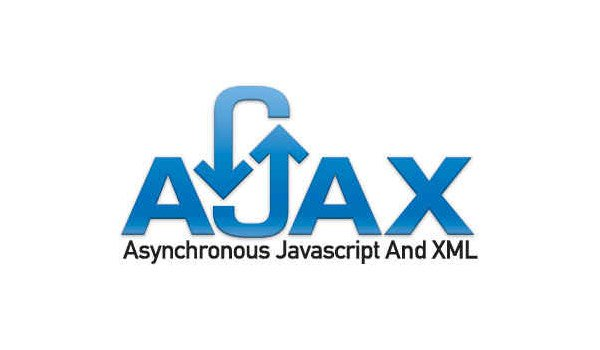
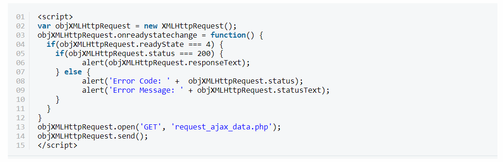

# AJAX

Ajax es una tecnología que permite hacer consultas por HTTP de manera asíncrona contra el servidor. Bajo esta definición, que puede no ser demasiado clara para algunas personas con poca experiencia en el entorno web, encontramos una de las herramientas más comunes en sitios, que han permitido evolucionar las aplicaciones web para que sean tan complejas como las conocemos hoy.

En pocas palabras, Ajax permite acceder a datos existentes en el servidor sin necesidad de recargar la página completamente. Estas consultas contra el servidor se realizan por medio de Javascript y los datos se procesan mediante éste mismo lenguaje, permitiendo actualizar el contenido de la página justamente donde sea preciso.

## ¿Qué es asíncrono?
Asíncrono en términos generales quiere decir que no tiene una relación temporal con otro proceso, o con la causa que lo produce. La definición linguística del término no acaba de aclarar el concepto en sí, así que vamos a tratar de explicarlo en términos informáticos y del lenguaje Javascript.

Asíncrono es todo proceso que tarda un tiempo en realizarse y que, durante ese tiempo, el motor de Javascript puede estar desocupado o realizando otras tareas. Cuando el proceso termina, entonces el motor de Javascript recibe una señal de recuperación y posiblemente un dato como respuesta, pudiendo seguir con la ejecución de código, así como realizar el tratamiento que corresponda sobre el dato recibido como respuesta.

**Ajax se compone de las siguientes tecnologías:**

1. XHTML y CSS para presentar información.
2. DOM (Document Object Model - modelo de objetos de documento) para visualizar e interactuar de forma dinámica la información presentada.
3. El objeto XMLHttpRequest para manipular los datos de forma asíncrona con el servidor web.
4. XML, HTML y XSLT para el intercambio y la manipulación de datos.
5. Se visualiza JavaScript para enlazar solicitudes e información de datos.
   

## ¿Cómo funciona AJAX usando JavaScript Vainilla?
Veamos el siguiente código de JavaScript de vainilla que realiza la llamada AJAX y obtiene una respuesta del servidor de forma asíncrona.

Revisemos el código anterior para entender lo que sucede detrás de la escena.

1. Primero, inicializamos el objeto XMLHttpRequest, que es responsable de hacer llamadas AJAX.
2. El objeto XMLHttpRequest tiene una propiedad readyState, y el valor de esa propiedad cambia durante el ciclo de vida de la solicitud. Puede contener uno de cuatro valores: OPENED, HEADERS_RECEIVED, LOADING y DONE.
3. Podemos configurar una función de escucha para cambios de estado usando la propiedad onreadystatechange. Y eso es lo que hemos hecho en el ejemplo anterior: hemos utilizado una función que se llamará cada vez que se cambie la propiedad del estado.
4. En esa función, hemos comprobado si el valor de readyState es 4, lo que significa que la solicitud se ha completado y hemos recibido una respuesta del servidor. A continuación, hemos comprobado si el código de estado es igual a 200, lo que significa que la solicitud fue exitosa. Finalmente, recuperamos la respuesta que está almacenada en la propiedad responseText del objeto XMLHttpRequest.
5. Después de configurar la escucha, iniciamos la solicitud llamando al método abierto del objeto XMLHttpRequest. El valor de la propiedad readyState se establecerá en 1 después de esta llamada.
6. Finalmente, hemos llamado al método de envío del objeto XMLHttpRequest, que en realidad envía la solicitud al servidor. El valor de la propiedad readyState se establecerá en 2 después de esta llamada.
7. Cuando el servidor responda, eventualmente establecerá el valor readyState en 4, y debería ver un cuadro de alerta que muestra la respuesta del servidor.

*Fuentes de consulta:*

https://www.ibm.com/docs/es/rational-soft-arch/9.6.1?topic=page-asynchronous-javascript-xml-ajax-overview

https://www.aprenderaprogramar.com/index.php?option=com_content&view=article&id=882:ique-es-y-para-que-sirve-ajax-ventajas-e-inconvenientes-javascript-asincrono-xml-y-json-cu01193e&catid=78&Itemid=206

https://desarrolloweb.com/home/ajax
